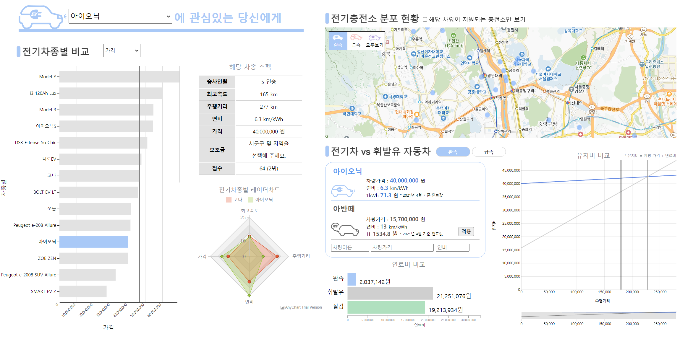

# Electric-Car-Dashboard
- Period : 2021.04.14 - 2021.06.04
- Member : 최은영, 강민석, 안성재, 어승준, 김가영
- Subject : 전기 자동차 분석 대시보드
- URL : https://nokcharathae.github.io/Electric-Car-Dashboard/

--- 

## Goals

본 프로젝트는 다양한 조건에 대한 전기차종별 비교 그래프를 나타내는 분석 대시보드를 구현한 웹 애플리케이션을 개발하는 것을 목표로 한다. 텍스트로만 주어져있는 전기차 정보들이 한눈에 파악하기 힘들기에 대시보드 형태로 가독성 있게 구성하였다.

## Project Stack

- Stack :    
- Deployment : Github, Sourcetree
